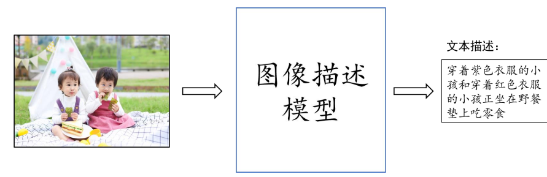

# NNDL_Project

深度学习课程设计：图像描述生成,为图片生成流畅关联的自然语言描述




# 环境配置

```bash
conda create -n nndlexp python=3.7.16
pip install -r requirments
```


# 任务

## 必选任务

- 数据集 仅用到image和textual descriptions https://github.com/yumingj/DeepFashion-MultiModal
- 至少实现下列**模型结构**中的两种：
  - CNN/ ViT整体表示+GRU
  - CNN/ ViT整体表示+GRU
  - 网格/区域表示、Transformer编码器+Transformer解码器
  - 网格/区域表示、图网络+ Transformer解码器
  - 视觉Transformer+Transformer解码器
- 至少实现两种**评测标准**
  - METEOR、ROUGE-L、CIDEr-D、SPICE

## 可选任务

- 基于强化学习的损失函数：默认实现的交叉熵损失和评测指标不一致，请实现基于强化学习的损失函数，直接优化评测指标
- 多模态预训练模型或多模态大语言模型：微调多模态预训练模型或多模态大语言模型，并测试性能
- 生成描述，构建数据集：利用训练的服饰图像描述模型和多模态大语言模型，为真实背景的服饰图像数据集增加服饰描述和背景描述，构建全新的服饰图像描述数据集

# 时间节点

- 中期报告：12.8
  - 中期报告文档： 
    - 系统概要设计
    - 原型系统开发
    - 题目，详细设计，已完成工作，问题及可能的解决方案，后续工作计划
  - 中期报告文档或答辩幻灯片（二选一）
- 结题报告：12.29
  - 结题报告文档（必选）：任务说明，实验数据，实验环境，所有的方法及模型，实验结果，实验结果分析，总结->JupyterNotebook
  - 口头报告幻灯片或者演示视频（二选一）

