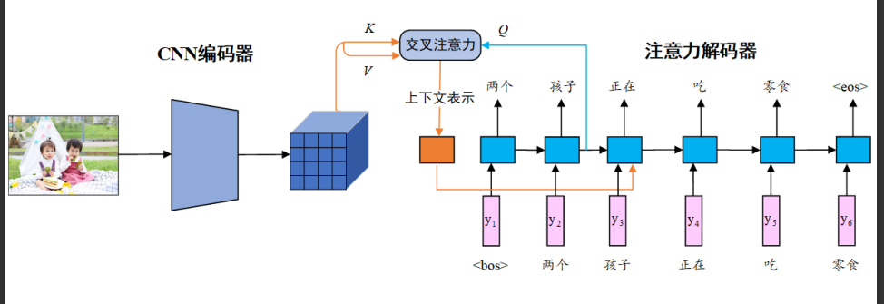
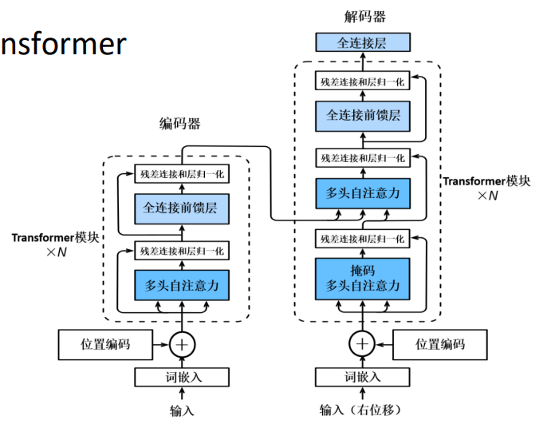

# 1 ResNet101+AttentionGRU



[torchvision官方文档:可选的分类模型](https://pytorch.org/vision/stable/models.html#classification)

[resnet101 预训练权重权重官方文档](https://pytorch.org/vision/stable/models/generated/torchvision.models.resnet101.html#torchvision.models.ResNet101_Weights)

ResNet101模型结构
```text
==========================================================================================
Layer (type:depth-idx)                   Output Shape              Param #
==========================================================================================
ResNet                                   [1, 1000]                 --
├─Conv2d: 1-1                            [1, 64, 112, 112]         9,408
├─BatchNorm2d: 1-2                       [1, 64, 112, 112]         128
├─ReLU: 1-3                              [1, 64, 112, 112]         --
├─MaxPool2d: 1-4                         [1, 64, 56, 56]           --
├─Sequential: 1-5                        [1, 256, 56, 56]          --
│    └─Bottleneck: 2-1                   [1, 256, 56, 56]          --
│    │    └─Conv2d: 3-1                  [1, 64, 56, 56]           4,096
│    │    └─BatchNorm2d: 3-2             [1, 64, 56, 56]           128
...
│    │    └─ReLU: 3-292                  [1, 2048, 7, 7]           --
│    └─Bottleneck: 2-33                  [1, 2048, 7, 7]           --
│    │    └─Conv2d: 3-293                [1, 512, 7, 7]            1,048,576
...
│    │    └─Conv2d: 3-299                [1, 2048, 7, 7]           1,048,576
│    │    └─BatchNorm2d: 3-300           [1, 2048, 7, 7]           4,096
│    │    └─ReLU: 3-301                  [1, 2048, 7, 7]           --
├─AdaptiveAvgPool2d: 1-9                 [1, 2048, 1, 1]           --
├─Linear: 1-10                           [1, 1000]                 2,049,000
==========================================================================================
Total params: 44,549,160
Trainable params: 44,549,160
Non-trainable params: 0
Total mult-adds (G): 7.80
==========================================================================================
Input size (MB): 0.60
Forward/backward pass size (MB): 259.72
Params size (MB): 178.20
Estimated Total Size (MB): 438.52
==========================================================================================
```
取最后一层图像表示形状 batchsize，2048，7，7


# 2 Transformer



